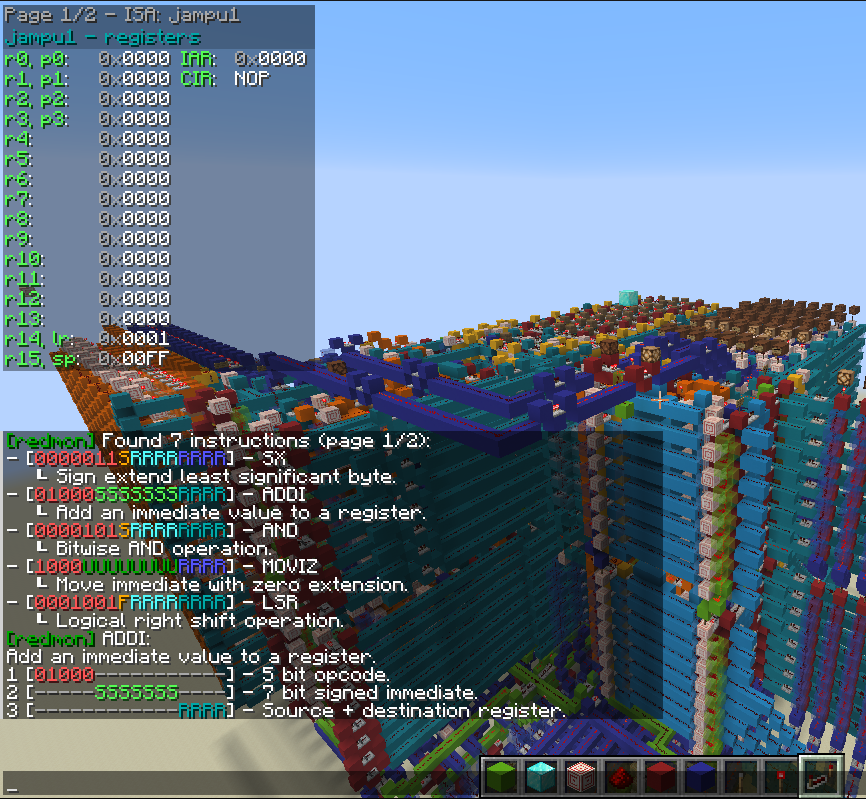
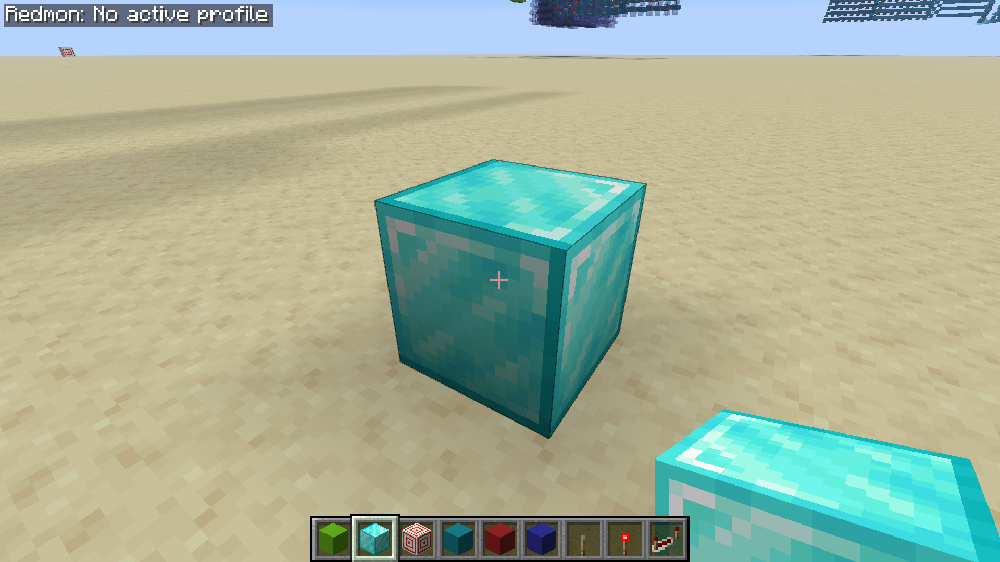
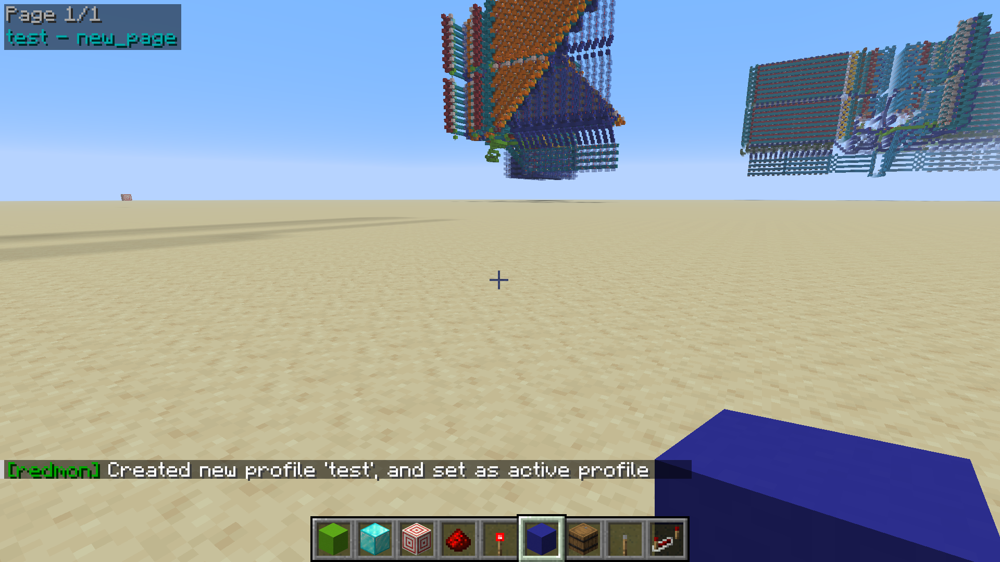
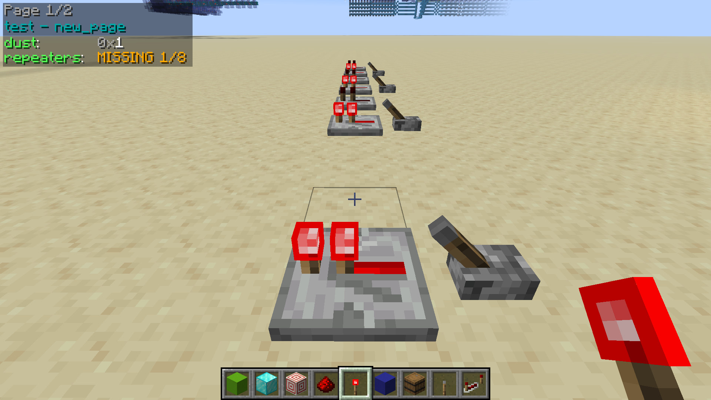
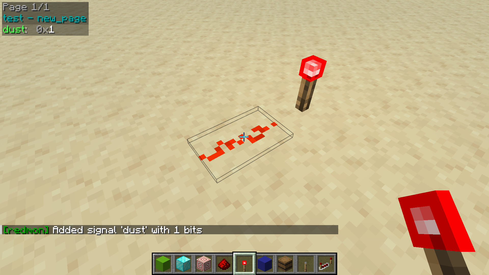
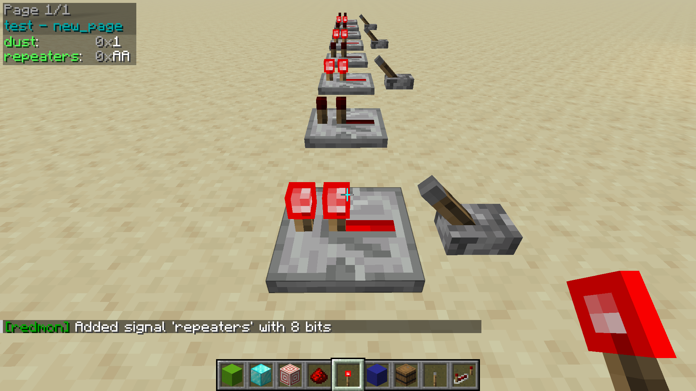
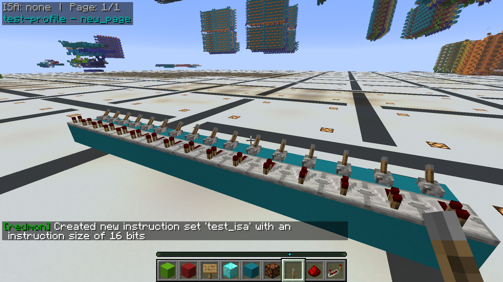
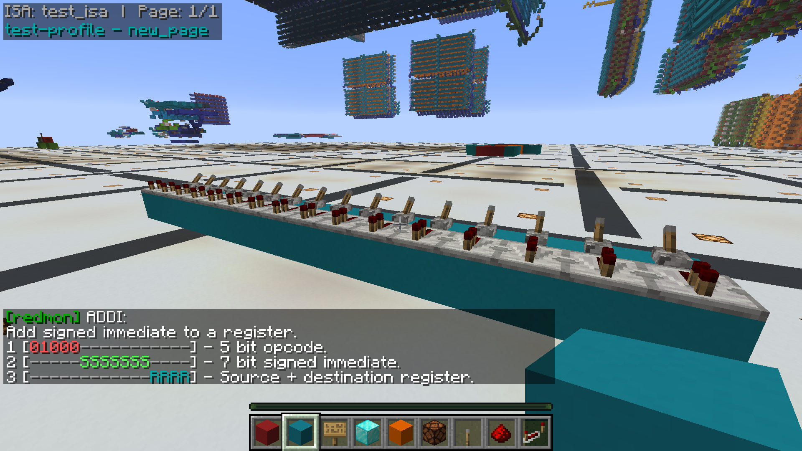
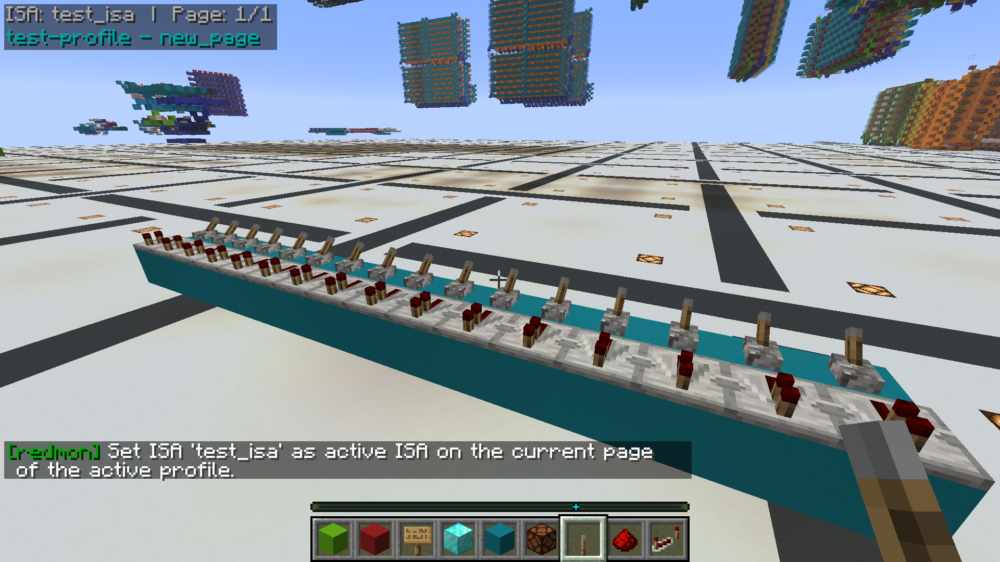
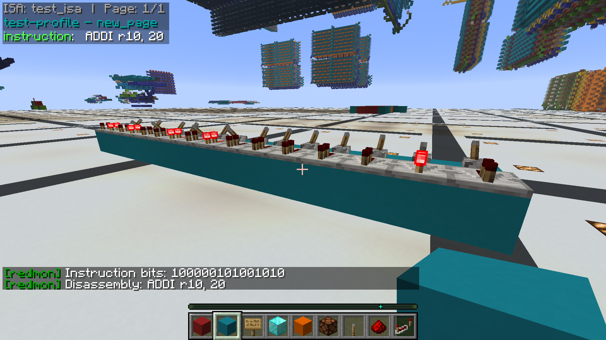

# Redmon

Redmon is a tool that allows you to create beautiful and functional in-game debug overlays for your redstone projects. 

The mod is intended for computational redstone projects, but it can be used for just about anything. Currently the mod 
supports the following blocks:

- Repeaters (on/off)
- Comparators (on/off)
- Torches (on/off)
- Redstone dust (on/off and signal strength)
- Redstone lamps (on/off)

### Table of contents

- [Quick-start guide](#quickstart-guide)
  - [Hotkeys](#hotkeys)
  - [Creating a profile](#creating-a-profile)
  - [Adding signals](#adding-signals)
- [Integrated disassembler](#integrated-disassembler)
  - [Creating an instruction set](#creating-an-instruction-set)
  - [Adding instructions](#adding-instructions)
  - [Viewing signal disassembly](#viewing-signal-disassembly)
- [Limitations](#limitations)
- [Roadmap](#roadmap)
- [Dedication](#dedication)

## Quickstart guide

### Hotkeys

The mod has a small number of dedicated hotkeys for common operations.

- `=` - Toggle visibility of the mod overlay.
- `[` - Show previous profile page.
- `]` - Show next profile page.

These hotkeys may be configured in the game settings.

### Creating a profile

Redmon functions using "profiles". Before any signals can be created or viewed, a profile must be created to contain
them. When you first load the mod, no profile will be selected (see top left). The first step to adding debug output to 
your build is to pick an activation location for your profile and mark it so that you can find it later:

Once you've chosen your reference block, stand on top of it and create a profile:

`/redmon profile create <profile-name>`

This will create an empty profile with the specified name and set it as the current profile with respect to your 
location in the world. After running this command, you should see the profile in the top left hand corner of your
screen like so:

- `new_page` - The current page the profile is on (default name).
- `test` - The name of the created profile.

Profiles are stored on disk at the following path `.minecraft/config/redmon_profiles.json` and are saved automatically
as you make changes. You can view your saved profiles with the `/redmon profile list` and `/redmon profile search`
commands.

Existing profiles may be selected as follows:

`/redmon profile select <profile-name>`

Whenever a profile is selected, it is "mapped" onto the world relative to the current player position. This allows
profiles to be applied to designs regardless of their position in the world. It is recommended to mark the position
where the profile was created so you know where to stand when re-selecting it later!

If components are missing or the profile has been selected at the wrong location, and the mod is consequently unable to 
find one or more blocks, errors will appear in the overlay like so:

You can also add additional pages to your profile which you can cycle through using [hotkeys](#hotkeys):

`/redmon page add <page-name>`

Finally, when you're done with the selected profile, you can run `/redmon profile deselect` to return the UI to its
default state.

### Adding signals

A signal is made up of a block (or set of blocks) that you wish to monitor in the overlay. Signals are added by looking 
at a block or wire and running the `/redmon signal add` command to add the signal to the currently active profile:

`/redmon signal add <signal-name> <signal-type> <block-count>`

There are currently 5 signal types to choose from:

- `repeater` - Redstone repeater.
- `torch` - Redstone torch.
- `dust` - Redstone dust.
- `dust_ss` - Redstone dust (signal strength).
- `comparator_binary` - Comparator.

The following screenshot depicts the outcome of running the command `/redmon signal create dust dust_binary 1` while
looking a section of redstone dust. This command creates a single redstone dust signal with the name "dust":

It is also possible to add signals with multiple blocks in a single command. This is done by aiming the reticule at the
component that represents the most significant bit in the desired signal, and passing a block count greater than one,
like so:

`/redmon signal create repeaters repeater 8`

When creating a multi-block signal like this, the mod will search for additional matching blocks along the cardinal 
direction which is closest to the player look angle. If the requested number of blocks aren't found, an error will be
displayed in the console. Be sure to face in the right direction when using this command!

Signals can also be removed, moved, renamed or reformatted using the following commands:

- `/redmon signal remove <signal-name>`
- `/redmon signal move <signal-name> (up|down) [<count>]`
- `/redmon signal move <signal-name> column <column-number>`
- `/redmon signal rename <signal-name> <new-signal-name>`
- `/redmon singal format <signal-name> <signal-format>`

## Integrated disassembler

Redmon contains an integrated disassembler which can perform on-the-fly disassembly of signals in the overlay. The
disassembler works by allowing the user to define an instruction set and then print instruction disassembly in the
overlay for selected signals. The disassembler also doubles as in-game documentation for the instruction set.

- Create an instruction set.
- Add instruction layouts to the instruction set.
- Assign an instruction set to current page of the active profile.

### Creating an instruction set

The first step to using the integrated disassembler is to create an instruction set to contain your instruction
layouts:

`/redmon isa create <isa-name> <instruction-size>`

In the above case, an ISA with the name `test_isa` has been created with the width of 16 bits. Existing instruction
sets may also be queried with:

`/redmon isa list [<page>]`

### Adding instructions

With the ISA created, instructions can now be added to it. Instructions are added using the following command:

`/redmon instruction add <isa-name> <instruction-name> <instruction-description> <instruction-fields>`

- `<isa-name>` -  The name of the ISA to add the instruction to.
- `<instruction-name>` - The name of the instruction (also the mnemonic that will appear in the overlay).
- `<instruction-description>` - Description, typically a short summary of what the instruction does.
- `<instruction-fields>` - A semicolon separated list of instruction field specifiers.

The following command for example creates an instruction called "ADDI" with a five bit opcode (01000), a seven bit
signed immediate value and a four bit register address. The instruction is added to the `test_isa` instruction set.

`/redmon instruction add test_isa ADDI "Add signed immediate to a register." opcode:01000; imm_s:7; reg_rw:4`

Field specifier breakdown for this command:

- `opcode:01000` - Configures the opcode for the instruction.
- `imm_s:7` - Seven bit signed immediate value.
- `reg_rw:4` - Four bit register address.

Once the instruction is created, you can view a detailed breakdown of the instruction fields like so:

`/redmon instruction info test_isa ADDI`

Instructions can have as many fields as you like, but their total size must match the width of the instruction set, and 
the opcode must not collide with that of any other instruction. Variable length opcodes are supported.

Available fields types are as follows:

- `opcode:<bit pattern>` - Opcode field.
- `flag_bit:<flag itentifier char>` - Single flag bit, expects a single character which names the flag.
- `imm_s:<bit count>` - Signed immediate field.
- `imm_u:<bit count>` - Unsigned immediate field.
- `reg_r:<bit count>` - Register read address field.
- `reg_w:<bit count>` - Register write address.
- `reg_rw:<bit count>` - Register read + write address.
- `ignore:<bit count>` - Bits ignored by this instruction.

### Enabling the ISA

Once an ISA is created, the next stage is to select it to the current profile page
(see [creating a profile](#creating-a-profile) for profile creation instruction). The following command will configure
the current page to use the selected ISA:

`/redmon isa select <isa-name>`

Once done, an indication will appear in the top left that the ISA is selected. ISA selections work on a per-page
basis, allowing a single profile to reference several instruction sets on different pages.

### Viewing signal disassembly

There are two ways to view disassembly, one is with the `./redmon isa disassemble` command, which will disassemble an
instruction passed directly in the command, and the other is by selecting the ISA by formatting a signal with the `asm` 
format specifier.

In the chat: `/redmon isa disassemble <isa-name> (bin|dec|hex) <instruction-word>`
In the overlay: `/redmon signal format <signal-name> asm`

Overlay with instruction disassembly in the chat and in the overlay:

If the instruction is not recognised or the wrong number of bits are present in the signal (more or less than the isa
size), then an error will be shown in the overlay.

## Limitations

- The mod is currently purely client-side, relying on block states to determine the state of components. This _works_
  but means that the mod can't see certain information (like the signal strength emitted by a comparator). For this to
  work, a server side component would be required.
- The mod currently only supports the fabric runtime (forge is not currently supported).

## Roadmap

There are a number of considered/planned features which are not currently included within the mod:

- Profile sharing.
- Support for large memory banks.
- 3D overlay to show positions of signals directly in the world.
- Server side component for more efficient and accurate signal updates.

## Dedication

To the RDF, the community where I got my first taste of computer science.

ORE is alright too I guess 😉
